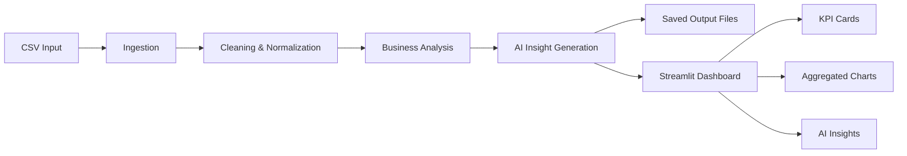

# AI-Powered Data Pipeline & Workflow Automation System

[](https://www.python.org/)
[](https://streamlit.io/)
[](https://openai.com/)
[](LICENSE)

An end-to-end AI analytics platform that turns raw CSV data into clean business reporting, automated insights, and a polished Streamlit dashboard.

This project solves a common business problem: raw operational data is hard to trust, hard to summarize, and slow to turn into decisions. The pipeline automates cleaning, analysis, and AI-generated reporting so stakeholders can move from CSV upload to executive-ready insight with minimal manual work.

## Why This Project Matters

This project demonstrates a practical, end-to-end analytics workflow that turns raw operational data into decisions-ready output.

- It reduces manual reporting effort by automating data cleaning, analysis, and insight generation.
- It shows how AI can be used responsibly for business summaries without replacing the underlying data logic.
- It presents results in a dashboard layout that is easy for non-technical stakeholders to scan and act on.
- It supports both interactive exploration and scheduled execution, which makes it useful beyond a one-off demo.

## Demo Snapshot

At a glance, the dashboard is designed to show:

- clean KPI cards for revenue, product, region, and row count
- pipeline execution status for transparency
- monthly revenue trend and top business dimensions
- AI insights and recommendations in readable bullet form

This makes the experience suitable for internal reporting, stakeholder reviews, and portfolio demos.

## Overview

This project combines a scheduled Python pipeline with an interactive Streamlit dashboard. It is designed to:

- load tabular data from CSV files
- clean and normalize the dataset
- generate structured AI insights using OpenAI
- save outputs to timestamped files
- visualize business metrics in a clean dashboard

The dashboard is optimized for business users and focuses on practical analytics such as revenue trends, top products, and geographic performance.

## Key Features

- Automated CSV ingestion and cleaning
- AI-generated structured insights and recommendations
- Timestamped JSON/TXT output files
- Streamlit dashboard with a polished KPI section
- Monthly revenue trend visualization
- Top 10 products and top 10 countries charts
- Scheduled pipeline execution support

## Screenshots

Add dashboard screenshots here to showcase the final UI.

| Image | Description |
| --- | --- |
| `dashboard-home.png` | Main overview with KPI cards and charts |
| `pipeline-status.png` | Pipeline execution status section |
| `ai-insights.png` | Insights and recommendations panel |

If you add images later, place them in a folder such as `assets/` and reference them here.

## How It Works



## Demo

1. Start the dashboard with `streamlit run ai_pipeline/streamlit_app.py`.
2. Upload a CSV file from the UI.
3. Click `Run Pipeline` to clean the data and generate insights.
4. Review the KPI cards, monthly trend, top products, and sales by country.
5. Read the AI insights and recommendations, then download the generated output.

Expected result:

- A clean executive dashboard with styled KPI cards
- A monthly revenue trend instead of noisy raw time-series plots
- Top 10 product and country charts that are easy to read
- Structured AI insights saved to `ai_pipeline/data/outputs/`

## Tech Stack

- Python
- Pandas
- Streamlit
- OpenAI API
- python-dotenv
- schedule

## Project Structure

```text
ai_pipeline/
├── config.py
├── data_pipeline.py
├── logging_config.py
├── main.py
├── pipeline.py
├── streamlit_app.py
├── data/
│   ├── input.csv
│   └── outputs/
├── logs/
└── stages/
    ├── ai_insights.py
    ├── analyze.py
    ├── clean.py
    ├── ingest.py
    └── output.py
```

## Requirements

- Python 3.10+
- An OpenAI API key
- A CSV file placed in `ai_pipeline/data/input.csv` for scheduled runs

## Installation

1. Clone the repository.
2. Create and activate a virtual environment.
3. Install dependencies:

```bash
pip install -r ai_pipeline/requirements.txt
```

## Configuration

Create a `.env` file in the project root and add your environment values:

```env
OPENAI_API_KEY=your_openai_api_key_here
AI_MODEL=gpt-4o-mini
SCHEDULE_HOURS=1
```

Optional settings:

- `AI_MODEL`: OpenAI model used for insight generation
- `SCHEDULE_HOURS`: how often the scheduled pipeline runs
- `SCHEDULE_MINS`: alternate scheduling value if you want minute-based control

## How to Run

### 1) Launch the Streamlit dashboard

```bash
streamlit run ai_pipeline/streamlit_app.py
```

This opens the interactive analytics dashboard where you can upload CSV data, run the pipeline, and review insights.

### 2) Run the scheduled pipeline

```bash
python ai_pipeline/main.py
```

This starts the scheduler and runs the pipeline at the configured interval.

## Dashboard Flow

The dashboard follows a clean analytics layout:

1. Data Preview
2. KPI Overview
3. Pipeline Status
4. Charts
5. AI Insights

The chart section focuses on meaningful aggregated views:

- Monthly revenue trend
- Top 10 products
- Top 10 countries

## Output

Generated insights are saved in `ai_pipeline/data/outputs/` with timestamped filenames:

- `insights_YYYYMMDD_HHMMSS.json`
- `insights_YYYYMMDD_HHMMSS.txt`

## Notes on Data

The app can infer a `Sales` column when the dataset contains `Quantity` and `UnitPrice`.

It also handles common business column names such as:

- `InvoiceDate`
- `Country`
- `Description`
- `Quantity`
- `UnitPrice`

## Logging

Pipeline logs are written to the `ai_pipeline/logs/` folder.

## Troubleshooting

- If the dashboard says the OpenAI key is missing, confirm `.env` contains `OPENAI_API_KEY`.
- If charts look empty, verify your CSV contains compatible columns such as `InvoiceDate`, `Country`, `Description`, `Quantity`, and `UnitPrice`.
- If the scheduler does not run, check that `SCHEDULE_HOURS` is a valid integer.

## Future Improvements

- Add richer visual themes and animation polish to the Streamlit dashboard.
- Support multiple input datasets and schema presets.
- Add export options for PDF or Excel reporting.
- Store historical runs for comparison over time.
- Add automated tests for pipeline stages and dashboard helpers.

## Recommended Workflow

1. Update `ai_pipeline/data/input.csv` with your latest dataset.
2. Run the Streamlit app for interactive analysis.
3. Use the scheduled runner if you want periodic insight generation.
4. Review files in `ai_pipeline/data/outputs/` for generated reports.

## Deployment

This repository is licensed under the MIT License. See [LICENSE](LICENSE) for details.

Note: the current app is built with Streamlit, so it is not a native Vercel deployment target.
For the full dashboard, use a Streamlit-friendly host such as Streamlit Community Cloud, Render,
Railway, or Hugging Face Spaces. If you want a Vercel deployment, the project would need a separate
frontend layer and a backend service for the pipeline.

## What Recruiters Will Notice

- Clear separation between ingestion, processing, AI analysis, and output stages
- Practical use of OpenAI for structured business insight generation
- Dashboard decisions based on grouped and aggregated data, not raw noisy plots
- Clean Streamlit UI that emphasizes readability and business usefulness
- Support for scheduled execution, which shows production-oriented thinking

## License

This project is licensed under the MIT License. See [LICENSE](LICENSE) for the full text.